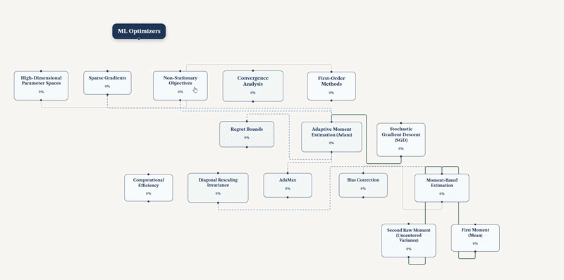

<p align="center">
  
  
  
  
  
</p>

# Study Buddy



An **agentic AI study companion** that works alongside your uploaded material. Drop a textbook chapter, lecture notes, or past papers -> the system builds a structured curriculum, generates grounded explanations, interactive figures, flashcards, quizzes, and Feynman-method drills. Every answer is sourced and cited; nothing is invented from model weights.

**Gemma 4 (31B) on Cerebras** runs at **1,500+ tokens/second**, making the entire experience feel instantaneous.

---

## Design Philosophy: Cerebras Speed Chose the Architecture

Most RAG tutoring apps make one LLM call, wait, and show the result. Study Buddy doesn't -> and the reason it *can't afford to* isn't a stylistic choice, it's a direct consequence of building on an inference provider fast enough that decomposition is cheaper than monolith. On a typical ~50–100 tok/s provider, splitting one job into five sequential calls multiplies latency five times over; on Cerebras at 900–1,500+ tok/s, five *small, structured, parallel* calls often finish before one large one would have even started streaming. That single fact shaped almost every non-obvious design decision in this codebase:

- **The curriculum is never generated in one shot.** `BrainAgent` derives the root + top-level sections in one fast call, then fans out one `expand_section()` call **per section, in parallel**, each scoped to only the documents that section actually draws from. A monolithic "read everything, emit the whole tree" prompt would blow past context budgets on multi-document uploads and produce a shallow tree; the decomposed version scales with document count instead of collapsing under it -> but it only *works* at Cerebras speed, because the frontend streams each node in as it resolves (`GRAPH_NODE_ADDED`) rather than waiting for every section to finish.
- **Chat's "Net Support" mode never does OpenAI-style single-shot tool calling.** When a question involves two distinct entities that could be confused with each other (two people sharing a name, a comparison between two papers), `NetResearchAgent.plan()` spins up one independent research sub-agent **per entity**, each with its own Tavily search and its own grounded summary, run concurrently via `asyncio.gather`. Only the final synthesis call ever sees all the labeled findings together. This is strictly more LLM calls than a single tool-calling loop -> a design that's only viable because those extra calls are nearly free in wall-clock time on Cerebras.
- **Every user-facing surface streams token-by-token** -> lessons, chat, Infinite Wiki cards, the Report Canvas -> not because streaming is fashionable, but because at 1,500+ tok/s the first token arrives fast enough that streaming is what makes the "instantaneous" feel real instead of aspirational.
- **The sandbox self-repairs instead of failing.** Generated HTML5 visuals get a server-side syntax pre-flight before ever reaching the iframe, and a client-side `onerror` triggers a repair round-trip (`POST /sandbox/repair`) rather than showing the student a red error. Round-tripping through another LLM call to fix broken code is only an acceptable UX (rather than a visible stall) when that round trip is sub-second.
- **Structured output, not prose parsing, everywhere.** Every agent call uses `strict=True` JSON-schema-constrained output (`CerebrasClient.structured_complete()`) rather than asking the model to describe a graph patch or a node assessment in free text and parsing it after the fact. This is deliberately *not* the cheapest way to get an answer out of the model -> it costs an extra schema validation round-trip on failure (see `structured_complete()`'s retry-once behavior for truncated/invalid JSON) -> but it's what makes fanning work out across a dozen small independent calls per interaction tractable, since every call's output is immediately typed and composable instead of needing its own bespoke parser.

In short: Cerebras didn't just make the app *feel* fast. Its speed is the reason the system is architected as many small, independently-verifiable, parallel agent calls instead of one large one -> a design that would be a latency liability on a slower provider and is instead Study Buddy's core advantage.

---

## Why Cognee Is Vital

RAG alone (ChromaDB, in this app) can only ever tell an agent **what the uploaded material says**. It has no memory of the student -> reload the same PDF next week and a pure-RAG tutor starts from zero, asking questions the student already answered correctly, re-teaching concepts they already mastered, and never noticing they've been stuck on the same weak spot across three separate sessions. That's the gap [Cognee](https://www.cognee.ai/) closes: it's the layer that remembers **how this specific student learns**, persisted locally and queried before every curriculum is built.

Concretely, in this codebase:

- **The Brain Agent reads Cognee before it writes a single curriculum node.** `StudentMemoryService.query_prior_knowledge()` recalls prior quiz accuracy, flashcard ease, Feynman attempts, and rubric-based mastery classifications for this student, scoped by topic -> so a returning student's tree generation is informed by what they already struggled with, not generated in a vacuum every time.
- **The Evaluator writes to it after every session**, not as an afterthought bolt-on but as the terminal step of the same mastery-scoring pipeline that updates the Knowledge Graph -> quiz correctness, flashcard grades, and Feynman-explanation attempts per node all get folded into a text summary and pushed into Cognee's session cache, then explicitly flushed into the permanent knowledge graph at session end (`cognee.improve()`).
- **It's session-cache-then-flush, not naive fire-and-forget**, deliberately: every "Push" (`EVALUATE_SESSION`) writes cheaply to a per-session cache (`cognee.remember(..., session_id=...)`) so mastery data is never lost mid-session, but the expensive graph-rebuild step (`cognee.improve()`) only runs once, at `END_SESSION` -> avoiding rebuilding the whole student memory graph on every quiz submission.
- **It never leaves the machine.** Cognee's data root is pinned to `~/.studybuddy/cognee/` (LanceDB for vectors, SQLite for relational metadata), and even its *embedding model* is forced to run locally (`fastembed`/`sentence-transformers`) rather than falling through to a cloud default -> because Cerebras has no embeddings endpoint of its own, and "local-first" would otherwise silently break the moment Cognee needed to embed something. Nothing about a student's learning history is ever sent anywhere but Cerebras (for the LLM calls that read/write it) and disk.
- **It's what makes "Adaptive Difficulty" adaptive across sessions, not just within one.** The four familiarity levels (ELI5 → Expert) change how a single session's prompts are phrased; Cognee is what lets the system additionally notice, over weeks, that a student is *consistently* weak on gradient descent specifically, regardless of which paper they're currently reading.

Without Cognee, Study Buddy would be a well-built single-session RAG tutor. With it, every session after the first one starts smarter than the last -> which is the actual premise of an agentic *study partner*, not just a document Q&A tool.

---

## Features

### Intelligent PDF Reader
- **Discontinuous text selection** -> hold Shift to accumulate multiple passages across pages; custom yellow highlight overlays persist until cleared with Escape
- **Margin gutter notes** -> switch to Annotate mode, select text, and write draggable sticky notes that pin to the page margin. Click to edit, clear to delete
- **Interactive figure regions** -> toggle Regions mode to auto-detect figures, tables, plots, and diagrams. Click any detected region to send it to Infinite Wiki or Chat, or pin it as a note

### Infinite Wiki
- **Contextual drill-down cards** -> select any text in the PDF and a streaming, grounded definition card appears. Highlight any term inside the card to drill deeper -> unlimited depth
- **Structured 3-part layout** -> every card streams a difficulty-adapted one-sentence summary, 3 core formulas/facts, and a 2-question active-recall quiz
- **Self-repairing HTML5 visualisations** -> scientific concepts auto-generate interactive Canvas simulations (orbital mechanics, wave interference, etc.). If the generated code errors at runtime, the sandbox catches it and self-heals via a repair endpoint
- **Web-augmented research** -> in Net Support mode, the wiki agent falls back to Tavily web search when the concept isn't covered in your material, with `[Web: Title](url)` citations

### Grounded Chat
- **RAG-powered Q&A** -> every answer cites its source chunk from your uploaded document
- **Rich markdown rendering** -> responses stream with headings, bullet lists, bold text, and web citation links
- **Context chip** -> the currently selected text is shown as a persistent chip above the input, grounding your questions

### Knowledge Graph
- **Auto-generated curriculum tree** -> the AI extracts a topic hierarchy from your material and renders it as an interactive node graph
- **Multi-document aware** -> upload several papers in one session and the tree balances coverage across all of them; genuinely overlapping concepts across papers merge into one visually-distinguished node, and every downstream tool (Chat, Feynman, lessons) is told a node is a merge so it attributes claims to the right source instead of blending them
- **Click-to-learn** -> click any concept node to stream a full lesson. The tutor never refuses to teach a concept, even if it's only tangentially mentioned in the text
- **Session-scoped RAG** -> document chunks are isolated per session; uploading a new PDF doesn't bleed into old sessions
- **Session History** -> every session is auto-titled from its content (not the filename) and resumable later without re-uploading, re-chunking, or re-indexing anything

### Study Tools
- **Flashcards** -> generated from your uploaded question papers
- **Quiz** -> timed self-assessment with graded answers
- **Feynman Method** -> explain the concept aloud to a curious Study Buddy persona (voice or text). The persona adapts its age and behaviour to your difficulty level (Age 5 for ELI5, Age 30 for Expert)
- **Speech-to-text** -> backend Canary neural transcription when available, with automatic Web Speech API fallback

### Report Canvas
- **Turns your own annotations into a report** -> highlight passages and write margin notes while reading, then compile them into a synthesized, textbook-style, streamed writeup -> not a summary of the PDF, a synthesis of *what you chose to capture*
- **Editable, not regenerate-from-scratch** -> ask for a rewrite ("more formal", "add an example") and it re-synthesizes from your already-processed notes instead of reprocessing everything
- **Auto-illustrated** -> the finished report is classified for a fitting visual (plot, diagram, or animation) and one is attached automatically

### Adaptive Difficulty
Four familiarity levels that reshape every interaction:

| Level | Label | Behaviour |
|---|---|---|
| 🍼 ELI5 | Age 5 | Sensory analogies, no math, cartoon-like explanations |
| 🏫 High School | Age 15 | Standard terms, real-world examples, algebra-level formulas |
| 🎓 Graduate | Age 22 | Domain competence assumed, rigorous derivations |
| 🧪 Expert | Age 30 | Pure synthesis, proofs, literature-level discourse |

### Privacy
- All student data stays **local** at `~/.studybuddy/` -> nothing goes to the cloud
- ChromaDB vector store, session memory, annotations, and summaries are all file-based
- The only outbound calls are to the Cerebras API (inference) and optionally Tavily (web search)

---

## 🛠 Prerequisites

| Tool | Version | Install |
|---|---|---|
| Python | 3.12+ | [python.org](https://www.python.org/downloads/) |
| uv | latest | `pip install uv` or [docs.astral.sh/uv](https://docs.astral.sh/uv/) |
| Node.js | 20+ | [nodejs.org](https://nodejs.org/) |

---

## Quick Start

```bash
# 1. Clone
git clone https://github.com/solusops/StudyBuddy.git
cd StudyBuddy

# 2. Python dependencies
cd backend
uv sync
cd ..

# 3. Node dependencies
npm install                        # Electron + root orchestration
npm install --prefix frontend      # React frontend

# 4. API keys
cp backend/.env.example backend/.env
# Edit backend/.env:
#   CEREBRAS_API_KEY=csk-...       (required)
#   TAVILY_API_KEY=tvly-...        (optional -> enables Net Support mode)
#   YOUTUBE_API_KEY=...            (optional -> enables Deep Dive)

# 5. Launch
npm run dev
```

Open **http://localhost:5173**. The "Start Studying" button activates once the backend finishes loading (~10–15s on first run while the embedding model warms up).

---

## 🖥 Running

| Command | What it does |
|---|---|
| `npm run dev` | Starts Vite (`localhost:5173`) + uvicorn (`127.0.0.1:8765`) concurrently |
| `npm run dev:electron` | Full Electron desktop shell + Vite |
| `cd backend && uv run uvicorn app.main:app --reload --host 127.0.0.1 --port 8765` | Backend only |
| `cd frontend && npm run dev` | Frontend only (browser, no Electron IPC) |

---

## 🚀 Full Deployment (No Installer)

Study Buddy does not ship a packaged installer/executable -> it's designed to be cloned and run as a standalone desktop app straight from source. This is the same three processes described above (Electron shell, Vite-built frontend, FastAPI backend), just run in production mode instead of `npm run dev`'s hot-reloading dev servers.

<details>
<summary>Click to expand -> clone, build, and launch as a standalone desktop app</summary>

```bash
# 1. Clone
git clone https://github.com/solusops/StudyBuddy.git
cd StudyBuddy

# 2. Python dependencies
cd backend
uv sync
cd ..

# 3. Node dependencies
npm install                        # Electron + root orchestration
npm install --prefix frontend      # React frontend

# 4. API keys
cp backend/.env.example backend/.env
# Edit backend/.env:
#   CEREBRAS_API_KEY=csk-...       (required)
#   TAVILY_API_KEY=tvly-...        (optional -> enables Net Support mode)
#   YOUTUBE_API_KEY=...            (optional -> enables Deep Dive)
# Keys can also be entered later from the in-app Setup screen -> it writes back to this same file.

# 5. Build the frontend for production (Vite dev server is not used in this flow)
npm run build --prefix frontend

# 6. Activate the backend's uv-managed virtualenv in this shell
#    (electron/main.js spawns a plain `python` process -> it must resolve to the
#    venv's interpreter, which is what has all backend dependencies installed)
#    Windows (PowerShell):
.\backend\.venv\Scripts\Activate.ps1
#    Windows (cmd.exe):
backend\.venv\Scripts\activate.bat
#    macOS / Linux:
source backend/.venv/bin/activate

# 7. Launch the desktop shell (production mode: loads frontend/dist, not localhost:5173)
npx electron .
```

Re-running the app after the first setup only requires steps 6 and 7 (re-activate the venv in your shell, then `npx electron .`) unless you `git pull` new backend dependencies or frontend changes, in which case re-run `uv sync` / `npm run build --prefix frontend` first.

</details>

---

## How to Use

1. **Upload content** -> drop a PDF, DOCX, or TXT (textbook chapters, lecture notes, problem sets)
2. **Upload questions** *(optional)* -> past exam papers or Q&A sheets for flashcards and quizzes
3. **Pick a familiarity level** -> ELI5 / High School / Graduate / Expert
4. **Choose knowledge mode** -> Content Only (strict RAG) or Net Support (web search fallback)
5. **Click "Start Studying"** -> the curriculum tree is auto-extracted from your material
6. **Click any node** on the knowledge graph to open the study panel with all tools
7. **Select text** in the PDF while reading to populate the context chip -> then:
   - Open **Infinite Wiki** for a grounded drill-down card with quiz
   - **Ask in Chat** for a RAG-sourced answer
   - Toggle **Regions** to detect and interact with figures/tables/plots
8. **Annotate** -> switch to Annotate mode, select text, and write a margin note
9. **End Session** -> scores your mastery and saves a Markdown summary to `~/.studybuddy/summaries/`

---

## System Design Patterns

Beyond the Cerebras-shaped decomposition described above, a handful of deliberate patterns recur throughout the codebase:

### Per-session isolation, all the way down

There is no shared, folder-wide upload state anywhere in the app. Every session gets its own upload folder (`~/.studybuddy/session_uploads/{session_id}/`), its own scoped ChromaDB retrieval (`document_ids` filters on every RAG call site), and its own journal. Duplication across sessions (the same PDF stored twice if uploaded in two sessions) is an accepted tradeoff for that isolation, not an oversight -> it means starting a new session, or resuming an old one, can never accidentally bleed in another session's files, chunks, or graph state.

### Content-addressed document identity

Two hash-based identifiers drive caching and dedup: a `file_id` (SHA-256 of one file's bytes) and a `document_id` (an order-independent combined hash of the whole file *set* in a session -> sorted per-file hashes, joined, re-hashed). Uploading the same set of papers again, in any order, resolves to the same `document_id`, which means the curriculum tree is *replayed* from `~/.studybuddy/graphs/doc_{document_id}.json` instead of regenerated -> a real latency and cost win for anyone re-studying the same material, with a defense-in-depth validity check (structural soundness + full document coverage) before a cached tree is trusted, falling back to regeneration if it isn't.

### Multi-stage curriculum generation with cross-paper merge detection

The curriculum pipeline is three explicit stages, not one call: `derive_root_and_sections()` (coarse root + sections, each tagged with which source document(s) it draws from) → `expand_section()` (one parallel call per section, fed only that section's relevant document excerpts, aware of sibling sections so it doesn't duplicate their topics) → `cleanup_curriculum()` (sees every node's source filenames and explicitly looks for the same concept described differently across papers, merging those into one node tagged `is_merged` with a `merge_summary` explaining what's shared vs. distinct). Every downstream consumer of a merged node -> lessons, chat, Feynman -> gets told it's a merge so it attributes claims to the correct paper instead of blending two treatments into one voice.

### Monotone mastery invariant

Node mastery scores (Memory / Comprehension / Structure / Application, 0–100 each) can only increase, never decrease -> enforced independently in both `GraphStateManager.apply_node_patch()` (backend) and `applyNodePatch()` (frontend store), because a single missed enforcement point would let a bad evaluation silently erase real progress. The Evaluator Agent never invents these numbers directly either: it classifies demonstrated understanding against a fixed rubric (from the *sophistication* of quiz answers, questions asked, and Feynman explanations), and a deterministic lookup table converts that classification into the actual score delta.

### Lazy generation + self-healing sandbox

Visuals are never generated eagerly -> `LEARN_NODE` returns lesson text only; the (often expensive) HTML5 visual is generated on-demand only when the student opens the Visual tab. Once generated, it goes through a server-side syntax pre-flight (`compile(script, '<visual>', 'exec')`) before ever reaching the sandboxed iframe (`sandbox="allow-scripts"`, `srcdoc` only, no external `src` -> fully self-contained), and a client-side runtime error triggers an automatic repair round-trip instead of surfacing a broken visualization to the student.

### Structured output as the connective tissue

Every agent-to-agent and agent-to-frontend boundary is a `strict=True` JSON-schema Pydantic model, never free-text parsing. `CerebrasClient._build_schema()` inlines `$ref`s and forces `additionalProperties: false` at every nesting level (Cerebras's strict mode rejects `$ref`), so a dozen independently-developed agents can compose without any of them needing a bespoke text parser for another agent's output.

### Defense-in-depth over trust-the-first-answer

Several pipelines validate a generated artifact and fall back rather than assuming success: a cached curriculum graph is checked for structural validity and full document coverage before replay; a curriculum "cleanup" pass that would drop content is rejected in favor of the pre-cleanup tree; a blank/generic curriculum root label triggers a second, differently-framed LLM attempt before ever falling back to (much weaker) filename-derived naming.

---

## 🧱 Architecture (Auto-Generated)

```tree
┌────────────────────────────────────────────────────────────────┐
│                        Electron Shell                          │
│  ┌────────────────────────┬────────────────────────────────┐   │
│  │     React Frontend     │       FastAPI Backend          │   │
│  │     (Vite, port 5173)  │       (uvicorn, port 8765)     │   │
│  │                        │                                │   │
│  │  PDFReader ◄──────────►│  WebSocket /ws/{session_id}    │   │
│  │  InfiniteWiki          │  ├─ BrainAgent (curriculum)    │   │
│  │  ChatTool              │  ├─ TutorAgent (lessons)       │   │
│  │  FlashcardTool         │  ├─ NetResearchAgent (chat)    │   │
│  │  QuizTool              │  ├─ StudyBuddyAgent (Feynman)  │   │
│  │  StudyBuddyTool        │  ├─ ReportAgent (canvas)       │   │
│  │  ReportView            │  ├─ WikiAgent / InfinityWiki   │   │
│  │  VisualSandbox         │  ├─ EvaluatorAgent             │   │
│  │  KnowledgeGraph        │  ├─ SensesAgent (vision)       │   │
│  │  EvaluationView        │  └─ ModalityRouter             │   │
│  │                        │                                │   │
│  │  Zustand Stores ──────►│  REST Routers                  │   │
│  │  (session, context,    │  ├─ /library   (per-session     │  │
│  │   interaction, graph)  │  │              upload+history) │  │
│  │                        │  ├─ /session   (create/commit/  │  │
│  │                        │  │              clear/trajectory)│  │
│  │                        │  ├─ /regions   (figure detect)  │  │
│  │                        │  ├─ /annotations (margin notes)  │  │
│  │                        │  ├─ /sandbox   (visual repair)   │  │
│  │                        │  ├─ /review    (Cognee recall)   │  │
│  │                        │  └─ /api       (health, keys)    │  │
│  │                        │                                │   │
│  │                        │  Services                      │   │
│  │                        │  ├─ ChromaDB (per-session RAG)  │   │
│  │                        │  ├─ StudentMemoryService(Cognee)│   │
│  │                        │  ├─ MemoryService (report/traj.)│   │
│  │                        │  ├─ session_files/session_commit│   │
│  │                        │  ├─ LayoutService (PyMuPDF)     │   │
│  │                        │  ├─ OutputCache / JournalService│   │
│  │                        │  └─ AnnotationService           │   │
│  └────────────────────────┴────────────────────────────────┘   │
│                              │                                  │
│              ┌───────────────┼────────────────┐                 │
│    ┌─────────▼──────────┐    │    ┌────────────▼───────────┐    │
│    │   Cerebras Cloud   │    │    │   Cognee (local)       │    │
│    │   Gemma 4 (31B)    │    │    │   LanceDB + SQLite      │    │
│    │   900-1,500+ TPS   │    │    │   ~/.studybuddy/cognee/ │    │
│    └─────────────────────┘    │    └─────────────────────────┘  │
│                              │ (optional)                       │
│                    ┌─────────▼──────────┐                       │
│                    │  Tavily / YouTube  │                       │
│                    │  / OpenAlex        │                       │
│                    │  (Net Support,     │                       │
│                    │   Deep Dive,       │                       │
│                    │   Further Reading) │                       │
│                    └────────────────────┘                       │
└──────────────────────────────────────────────────────────────────┘
```

---

## 📂 Project Structure (Auto-Generated)

<details><summary>Click to expand</summary>

```text
StudyBuddy/
├── electron/                  # Electron main process + preload IPC bridge
├── backend/
│   ├── app/
│   │   ├── agents/            # AI agent layer
│   │   │   ├── brain_agent.py         # Curriculum extraction, multi-doc merge, session titles
│   │   │   ├── tutor_agent.py         # Lesson streaming, flashcards/quiz, visual generation
│   │   │   ├── net_research_agent.py  # Chat query decomposition + per-entity web research
│   │   │   ├── study_buddy_agent.py   # Feynman-method persona ("Clara")
│   │   │   ├── report_agent.py        # Report Canvas: note→insight, insight→report synthesis
│   │   │   ├── wiki_agent.py          # Infinite Wiki card generation
│   │   │   ├── infinity_wiki_agent.py # Deep Dive: YouTube search + transcript summarization
│   │   │   ├── evaluator_agent.py     # Rubric-based mastery classification
│   │   │   ├── senses_agent.py        # Vision model (figure/table description)
│   │   │   ├── modality_router.py     # Routes concepts/reports to best visual type
│   │   │   ├── cerebras_client.py     # Cerebras SDK wrapper (structured + streaming)
│   │   │   └── cerebras_errors.py     # Error classification & rate-limit handling
│   │   ├── rag/               # ChromaDB vector store, embeddings, chunker
│   │   ├── schemas/           # Pydantic data contracts (graph, journal, annotations, session)
│   │   ├── services/          # Business logic
│   │   │   ├── session_files.py       # Per-session upload folder isolation
│   │   │   ├── session_commit.py      # Session History commit (shared by REST + WS)
│   │   │   ├── student_memory.py      # Cognee-backed cross-session memory (StudentMemoryService)
│   │   │   ├── memory_service.py      # Disk-only report clusters + eval trajectory (NOT Cognee)
│   │   │   ├── journal_service.py     # In-memory per-session interaction journal
│   │   │   ├── progress_service.py    # Deterministic (no-LLM) per-node activity tally
│   │   │   ├── scholar_service.py     # OpenAlex "Further Reading" lookup
│   │   │   ├── youtube_service.py     # YouTube search + transcript fetch
│   │   │   ├── layout_service.py      # PyMuPDF page segmentation (figures/tables)
│   │   │   ├── output_cache.py        # Deterministic cache for LLM outputs
│   │   │   ├── annotation_service.py  # Margin-note CRUD + persistence
│   │   │   ├── graph_state.py         # Graph state manager (monotone-score enforcement)
│   │   │   └── summary_writer.py      # End-of-session Markdown export
│   │   ├── routers/           # FastAPI REST endpoints
│   │   │   ├── library.py          # Per-session upload+start, Session History, refine-tree
│   │   │   ├── session.py          # create / ingest-status / commit / trajectory / clear
│   │   │   ├── regions.py          # Figure/table segmentation
│   │   │   ├── annotations.py      # CRUD for margin notes
│   │   │   ├── sandbox.py          # Visual self-repair endpoint
│   │   │   ├── review.py           # Cognee-backed spaced-repetition review query
│   │   │   └── health.py           # Readiness probe + runtime API key management
│   │   └── websockets/
│   │       └── handlers.py         # Central event dispatch (BUILD_GRAPH, CHAT_TURN, etc.)
│   └── tests/                 # pytest suite
├── frontend/
│   └── src/
│       ├── components/
│       │   ├── graph/              # KnowledgeGraph, ConceptNode
│       │   ├── panel/              # ScientificFigurePanel, InfiniteWiki, ReportView, EvaluationView, VisualSandbox
│       │   ├── reader/              # PDFReader, HighlightLayer, RegionLayer, MarginGutter
│       │   ├── study-tools/         # ChatTool, FlashcardTool, QuizTool, StudyBuddyTool
│       │   ├── overlay/             # FloatingToolbar (cursor mode switcher)
│       │   └── init/                # SetupModal (onboarding, Session History list)
│       ├── hooks/                  # useWebSocket
│       ├── lib/                    # fileSystem (Electron IPC + browser fallback), clearSession
│       ├── pages/                  # TreePage (graph + Push/Report), ManualPage (reader-first flow)
│       ├── store/                  # Zustand: graphStore, sessionStore, contextStore, interactionStore
│       └── types/                  # Shared TypeScript interfaces
└── package.json               # Root orchestration (concurrently, electron-forge)
```

</details>

---

## Running Tests

```bash
# Full backend suite
cd backend
uv run pytest tests/ -v

# Single test file
uv run pytest tests/test_tutor_lesson.py -v

# Frontend tests
cd frontend
npx vitest run
```

---

## 🔑 Environment Variables

| Variable | Required | Description |
|---|---|---|
| `CEREBRAS_API_KEY` | ✅ | Cerebras Cloud API key for Gemma 4 inference |
| `TAVILY_API_KEY` | ❌ | Enables "Net Support" knowledge mode (web search fallback) |
| `YOUTUBE_API_KEY` | ❌ | Enables Deep Dive video search |
| `ALLOWED_ORIGINS` | ❌ | CORS origins (defaults to `http://localhost:5173`) |

---

## License

Apache 2.0
